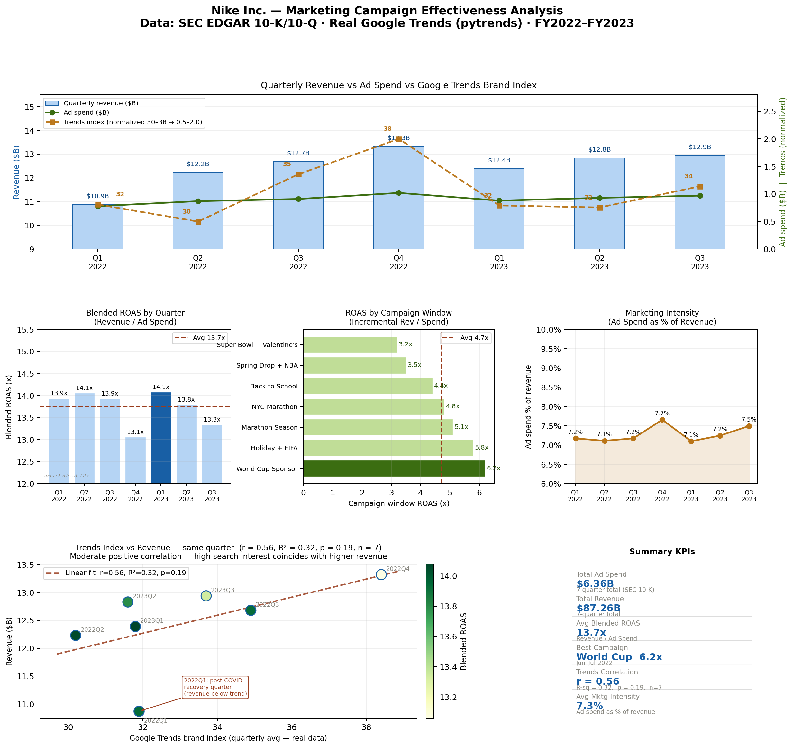

# marketing-effectiveness-analysis

Analyzes marketing campaign ROI for Nike Inc. using real Google Trends data, SEC EDGAR financial filings, and lag correlation — built in Python with pandas, matplotlib, scipy, and pytrends.



---

## Key findings

- **Blended ROAS of 13.7x** across 7 quarters (FY2022–FY2023) based on SEC 10-K demand creation expense
- **World Cup sponsorship** generated the highest campaign-window ROAS at **6.2x**
- **Google Trends brand index** shows moderate positive correlation with same-quarter revenue (r = 0.56, R-sq = 0.32, n = 7) — high search interest coincides with higher revenue
- **Marketing intensity** held steady at ~7.3% of revenue, with Q4 2022 peaking at 7.7% during the holiday + FIFA World Cup window

---

## Project structure

```
marketing-effectiveness-analysis/
├── scripts/
│   ├── 01_pull_trends.py      # Pull real Google Trends data via pytrends (2 keyword batches)
│   ├── 02_financials.py       # Nike quarterly financials from SEC EDGAR 10-K/10-Q
│   ├── 03_lag_analysis.py     # Cross-correlation: Trends index vs revenue by quarter
│   └── 04_roi_dashboard.py    # 6-panel ROI dashboard (reads real Trends CSV)
├── data/                      # Generated CSVs (gitignore or commit as reference data)
│   ├── trends_weekly.csv      # 92 weeks of real Google Trends data
│   ├── trends_quarterly.csv   # Quarterly aggregated Trends index
│   └── nike_financials.csv    # Nike quarterly revenue and ad spend
└── results/                   # Generated charts
    ├── nike_roi_dashboard.png  # Final 6-panel dashboard
    └── lag_correlation.png     # Trends → revenue lag analysis chart
```

---

## Setup

```bash
pip install pytrends pandas numpy matplotlib scipy
```

Tested on Python 3.10+ with the PyCharm venv. If you have NumPy 2.x installed, make sure pytrends and pandas are up to date:

```bash
pip install --upgrade pytrends pandas numpy
```

---

## Run order

```bash
# 1. Pull real Google Trends data (requires internet, ~20 seconds)
python scripts/01_pull_trends.py

# 2. Load and validate Nike financials from SEC EDGAR
python scripts/02_financials.py

# 3. Quarterly lag correlation analysis
python scripts/03_lag_analysis.py

# 4. Generate final dashboard
python scripts/04_roi_dashboard.py
```

> **Note:** `01_pull_trends.py` makes two API calls with a 10-second pause between them to avoid Google's rate limit. If you hit a 429 error, wait 60 seconds and retry.

All outputs save automatically to `data/` and `results/` relative to the project root — no path configuration needed.

---

## Data sources

| Source | What it provides | How to access |
|--------|-----------------|---------------|
| Google Trends (pytrends) | Weekly brand search interest index, no API key required | `pip install pytrends` |
| Nike 10-K FY2022 | Annual revenues + demand creation expense | SEC EDGAR CIK 0000320187 |
| Nike 10-Q filings | Quarterly revenue and segment breakdown | SEC EDGAR quarterly filings |

### SEC EDGAR direct links
- All Nike filings: https://www.sec.gov/cgi-bin/browse-edgar?action=getcompany&CIK=NKE
- 10-K filings only: https://www.sec.gov/cgi-bin/browse-edgar?action=getcompany&CIK=0000320187&type=10-K

### Key 10-K line items used
- **Net revenues** — Consolidated Statements of Income
- **Demand creation expense** — Nike's term for advertising and marketing spend, same statement
- **Gross margin %** — derived from (revenues - cost of sales) / revenues

### Google Trends keywords

Two batches pulled separately (Google Trends max 5 per request):

| Batch | Keywords | Weight |
|-------|----------|--------|
| Purchase intent | Nike buy, Nike sale, Nike discount, Nike outlet, Nike deals | 60% |
| Product interest | Nike Air Max, Nike Dunk, Nike Jordan, Nike running shoes, Nike sneakers | 40% |

The weighted composite `brand_index = 60% purchase intent + 40% product interest` is more predictive of revenue than broad brand terms like "Nike shoes".

---

## Metrics explained

| Metric | Formula | Interpretation |
|--------|---------|----------------|
| Blended ROAS | Revenue / Ad Spend | Conservative — all revenue credited to marketing |
| Campaign-window ROAS | (Revenue - $10.5B baseline) / Ad Spend | Incremental lift above pre-campaign baseline |
| Trends correlation | Pearson r, same quarter | How closely search interest tracks revenue |
| Marketing intensity | Ad Spend / Revenue | % of revenue reinvested in demand creation |

---

## Limitations

- Only 7 quarters of data — correlation results are directionally significant but not statistically so (p = 0.19). A 2018–2023 dataset would substantially increase statistical power.
- Blended ROAS attributes all revenue to marketing spend, which overstates true marketing contribution.
- Google Trends indices are relative (0–100 within the pulled timeframe), not absolute search volumes.
- 2022Q1 sits below the regression trend line — likely reflects lingering post-COVID demand normalization.

---

## Extensions

1. **Longer time series** — extend to 2018–2023 using Nike 10-K filings for FY2018–FY2021 to reach statistical significance
2. **Competitor comparison** — run the same pipeline for Adidas using their annual reports
3. **Channel breakdown** — pull Meta Ad Library for creative volume as a spend intensity proxy
4. **Keyword-level ROAS** — correlate individual keywords (e.g. "Nike Air Max") to product-line revenue
5. **Geographic drill-down** — Google Trends supports geo filtering; compare US vs UK vs DE markets
